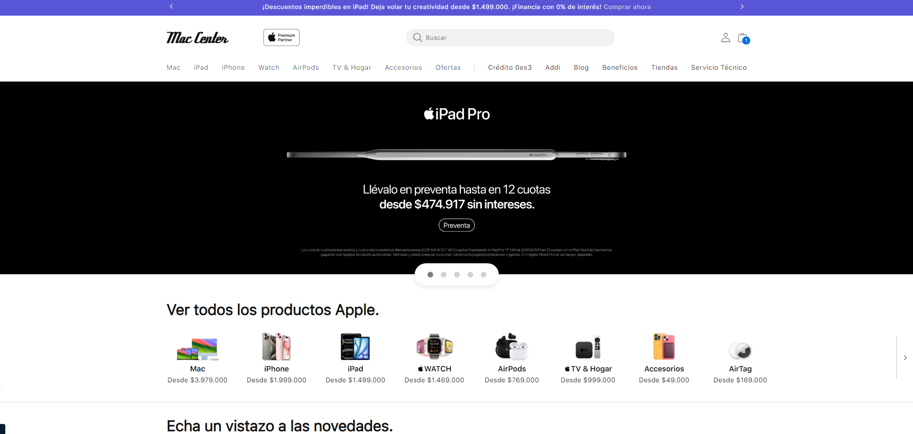

# Automatización de mac-center.com y Servicios API de Marvel

## Descripción del Proyecto

Este proyecto tiene como objetivo automatizar pruebas para la página web [mac-center.com](https://mac-center.com) y los servicios API de Marvel utilizando el patrón Screenplay con Serenity y Java. Las pruebas automatizadas garantizan la funcionalidad y fiabilidad tanto de la interfaz de usuario de la página web como de las interacciones con las APIs de Marvel.

